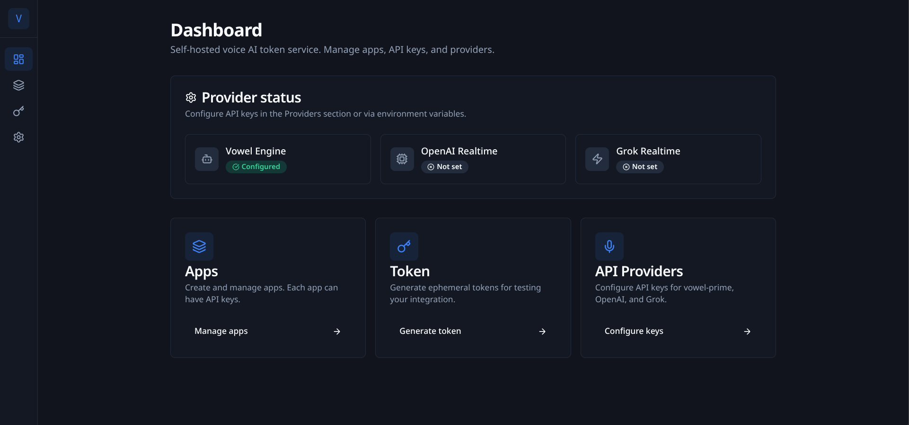

# Vowel Core

Self-hosted token service + Web UI for the vowel platform. Ephemeral token minting for Vowel Engine, OpenAI Realtime, and Grok Realtime. Create apps, API keys, and generate tokens.



## Quick Start

```bash
bun install
cd ui && bun install
cd .. && bun run db:init
bun run dev          # Elysia API (standalone, serves built UI if present)
bun run dev:ui      # vinext dev server (UI only, proxies /api/* to API)
```

For full dev with hot reload: run `bun run dev:api` (API on 3001) and `bun run dev:ui` (UI on 3000). Or build UI once and use Elysia standalone:

```bash
bun run build       # Build vinext UI to ui/dist
bun run dev         # Elysia serves API + static UI
```

Or run both dev servers concurrently from one command:

```bash
bun run dev:stack
```

Open http://localhost:3000

## Tests

```bash
bun test
```

## Cloudflare Tunnel

For local dev with a public URL (e.g. WebSocket testing):

```bash
bun run dev:tunnel
```

This starts Core API + UI in dev mode and immediately starts the Cloudflare tunnel.
If API or UI are already running, `dev:tunnel` will reuse them and avoid
starting duplicate dev processes.
Requires `CLOUDFLARE_TUNNEL_TOKEN` in `.env`. See `docs/CLOUDFLARE_TUNNEL.md`.

Environment options:

```bash
bun run dev:tunnel:testing   # uses testing-core.vowel.to
bun run dev:tunnel:dev       # uses core-dev.vowel.to
bun run dev:tunnel:staging   # uses staging-core.vowel.to
bun run dev:tunnel:production # uses core.vowel.to (requires caution)
```

## Environment

See `.env.example` for required variables.

## Plan

See [`.ai/plans/mar-26/core-self-hosted/`](../.ai/plans/mar-26/core-self-hosted/README.md) for the self-hosted Core plan and [`.ai/plans/local-docker-stack/`](../.ai/plans/local-docker-stack/README.md) for the Core + sndbrd Docker Compose plan.
